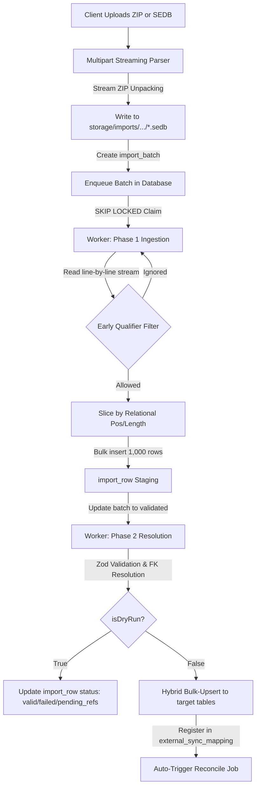

# Büroware ERP Import System — Technical Specification

This document defines the architecture, database schema modifications, streaming parser algorithms, and asynchronous processing contracts for the multi-tenant Büroware ERP import pipeline.

---

## 1. Problem Statement & Context

Büroware ERP exports master and transactional data in a positional, fixed-width format (typically `.SEDB` files) governed by metadata schemas (`Satzbeschreibung.csv`). Processing these files presents unique challenges:

*   **Massive File Size**: Production exports for articles, documents, and document lines can range from hundreds of megabytes to multiple gigabytes. Loading these files entirely into memory (RAM) is impossible and would crash the server instance.
*   **Mixed Row Qualifiers (Mischdateien)**: Files often contain mixed record types. For example, `S_RART_R00.SEDB` contains lines starting with `S` (Articles), `W` (Warengruppen), `l` (Storage Locations), but also other qualifiers like `F`, `t`, or even leading spaces. Processing these without strict early filtering causes unnecessary CPU overhead and database bloating.
*   **Relative Positional Offsets**: Position indices (e.g. `Pos` in `Satzbeschreibung.csv`) are relative to the data block *after* the single-character qualifier. That is, character offset `0` is the qualifier, and `Pos = 1` starts at character offset `1`.
*   **Idempotency & Repeated Imports**: ERP exports are repeatedly run. The pipeline must use the external primary key from the source system (e.g., article number key like `ART_1_25`, address key `ADR_2_8`) to perform idempotent upserts rather than duplicating records.
*   **Foreign Key Resolution (Stammbezüge)**: Many fields represent foreign key relations (e.g. article warengruppe pointing to a warengruppe, or standard supplier pointing to an address). Inbound files may arrive out of order, meaning referenced entities might not exist in the database at the time of ingestion.

---

## 2. Architectural Overview (Two-Phase Pipeline)

To protect the server from memory exhaustion and database lock-ups, the import process is split into two asynchronous phases:



### Phase 1: Streaming Ingestion & Staging
*   The upload is directly streamed to disk.
*   The worker reads the file line-by-line via a stream, filters lines by their leading qualifier, parses fixed-width chunks based on the mapping, and writes raw records in bulk (1,000-row chunks) to the `import_row` staging table. No core tables are modified.

### Phase 2: Resolution & Posting
*   Staging rows are processed in 1,000-row chunks.
*   Foreign keys are resolved using `external_sync_mapping`.
*   If in **Dry-Run** mode, validation outcomes are written back to `import_row` status columns.
*   If in **Production** mode, validated rows are bulk-upserted into target tables (`article`, `address`, etc.) using a hybrid model: native columns map directly to table columns, and custom fields map into the `custom_attributes` JSONB blob.

---

## 2.5. Bootstrapping Mappings from Schema (Satzbeschreibung.csv)

To handle files with huge numbers of field definitions (like the 719 definitions for `S_RART_R00.SEDB`), the system will automate the creation of the mapping schema by ingesting the `Satzbeschreibung.csv` metadata file:

1. **Schema Upload & Bootstrap Endpunkt**:
   The tenant uploads `Satzbeschreibung.csv` via the endpoint `POST /api/import/profiles/:profileId/bootstrap`.
2. **Filtering by Target File**:
   The CSV parser reads the metadata stream and filters for records where the `Datei` column matches the profile's expected filename (e.g. `S_RART_R00.SEDB`).
3. **Translation Dictionary (Büroware Feld-ID -> Target Field)**:
   The system maps the Büroware `FeldId` (and `Refreshtabelle` reference metadata) to target database fields using a pre-defined catalog translation map.
   *   **Known Fields Dictionary**:
       *   `ART_1_25` (Artikelnummer) ➔ `articleNo`
       *   `ART_36_5` (Warengruppe) ➔ `articleGroupId` (references `article_group`)
       *   `ART_51_60` (Text) ➔ `name`
       *   `ART_138_8` (Standardlieferant 1) ➔ `supplierId` (references `address`)
       *   `ADR_2_8` (Adressnummer) ➔ `addressNo`
       *   `ADR_20_30` (Firmenname) ➔ `companyName`
   *   **Automatic Custom Attributes Fallback**:
       Any `FeldId` in the schema file not matching the known dictionary is automatically mapped to `customAttributes.<normalized_bezeichnung>` (e.g. `ART_122_5` (Provision in %) maps to `customAttributes.provisionInPercent`), ensuring 100% field coverage out-of-the-box.
4. **Relational Field Mapping Generation**:
   For each filtered CSV row, the bootstrap service generates a record in the `import_field_mapping` table under a new mapping version:
   *   `position` ➔ `Pos` (relativer Offset)
   *   `length` ➔ `Länge`
   *   `qualifier` ➔ `Satzkürzel`
   *   `formatting` ➔ `Formatierung` (used by the parser to apply formatting rules like `AJN` for booleans or decimals)
   *   `targetField` ➔ resolved target column name or custom attribute key.

---

## 3. Database Schema Modifications

To transition from a schemaless JSONB mapping implementation to a robust, relational model, the following schema definition is specified for `packages/db/src/schema/app.schema.ts`:

### A. Core Mappings

We consolidate the mapping schema by removing the draft-only `tenant_connector_mapping` table and creating `import_field_mapping` as the child table of the versioned mapper:

```typescript
import { pgTable, uuid, text, integer, boolean, timestamp, unique, index, check } from "drizzle-orm/pg-core";
import { sql } from "drizzle-orm";
import { tenant } from "./tenant.schema"; // assuming tenant table is imported
import { importProfile, importProfileMappingVersion } from "./import.schema";

export const importFieldMapping = pgTable(
  "import_field_mapping",
  {
    mappingId: uuid("mapping_id")
      .primaryKey()
      .default(sql`uuidv7()`),
    tenantId: uuid("tenant_id")
      .notNull()
      .references(() => tenant.tenantId),
    versionId: uuid("version_id")
      .notNull()
      .references(() => importProfileMappingVersion.versionId),
    // Fixed-width positional columns
    position: integer("position"), // 1-based index starting after the qualifier
    length: integer("length"),     // length of the slice
    qualifier: text("qualifier"),   // e.g. 'S', 'W', 'l'
    formatting: text("formatting"), // formatting directive (L, R0, R2, AJN)
    
    // CSV configuration compatibility
    sourceField: text("source_field"), // column name if file is CSV
    
    // Target schema details
    targetField: text("target_field").notNull(), // target column name (native or custom)
    isRequired: boolean("is_required").notNull().default(false),
    defaultValue: text("default_value"),
    createdAt: timestamp("created_at", { withTimezone: true }).notNull().defaultNow(),
  },
  (table) => [
    index("idx_field_mapping_version").on(table.versionId),
    index("idx_field_mapping_tenant").on(table.tenantId),
  ]
);
```

### B. Idempotency Mapping (Evolving `external_sync_mapping`)

`external_sync_mapping` is evolved to act as the central reference dictionary for all external systems, making `salesChannelId` optional and introducing a generic `sourceSystem` column:

```typescript
export const externalSyncMapping = pgTable(
  "external_sync_mapping",
  {
    mappingId: uuid("mapping_id")
      .primaryKey()
      .default(sql`uuidv7()`),
    tenantId: uuid("tenant_id")
      .notNull()
      .references(() => tenant.tenantId),
    salesChannelId: uuid("sales_channel_id"), // Nullable for direct ERP uploads
    sourceSystem: text("source_system").notNull(), // e.g. 'bueroware'
    entityType: text("entity_type").notNull(),     // e.g. 'article', 'address', 'article_group'
    internalId: uuid("internal_id").notNull(),     // target UUID in article/address/etc.
    externalId: text("external_id").notNull(),     // source key e.g. 'ART_1_25'
    createdAt: timestamp("created_at", { withTimezone: true }).notNull().defaultNow(),
    updatedAt: timestamp("updated_at", { withTimezone: true }).notNull().defaultNow(),
  },
  (table) => [
    index("idx_ext_sync_tenant_lookup").on(table.tenantId, table.sourceSystem, table.entityType),
    unique("uq_ext_sync_external_key").on(
      table.tenantId,
      table.sourceSystem,
      table.entityType,
      table.externalId
    ),
  ]
);
```

### C. Staging Schema Modifications (`import_batch` and `import_row`)

We extend `import_batch` and `import_row` to support dry-run flags, detailed tracking of missing references, and error reporting:

```typescript
// Evolved importBatch fields
export const importBatch = pgTable(
  "import_batch",
  {
    batchId: uuid("batch_id")
      .primaryKey()
      .default(sql`uuidv7()`),
    tenantId: uuid("tenant_id")
      .notNull()
      .references(() => tenant.tenantId),
    profileId: uuid("profile_id").references(() => importProfile.profileId),
    mappingVersionId: uuid("mapping_version_id").references(() => importProfileMappingVersion.versionId),
    status: text("status").notNull().default("queued"), // 'queued', 'processing', 'validated', 'posted', 'failed'
    isDryRun: boolean("is_dry_run").notNull().default(true),
    postedEntityCount: integer("posted_entity_count").notNull().default(0),
    failedEntityCount: integer("failed_entity_count").notNull().default(0),
    pendingReferenceCount: integer("pending_reference_count").notNull().default(0),
    errorSummary: jsonb("error_summary"),
    filePath: text("file_path"), // storage location of the uploaded file
    createdAt: timestamp("created_at", { withTimezone: true }).notNull().defaultNow(),
    processedAt: timestamp("processed_at", { withTimezone: true }),
  },
  (table) => [
    check("import_batch_status_check", sql`status IN ('queued', 'processing', 'validated', 'posted', 'failed')`),
  ]
);

// Evolved importRow fields
export const importRow = pgTable(
  "import_row",
  {
    rowId: uuid("row_id")
      .primaryKey()
      .default(sql`uuidv7()`),
    tenantId: uuid("tenant_id")
      .notNull()
      .references(() => tenant.tenantId),
    batchId: uuid("batch_id")
      .notNull()
      .references(() => importBatch.batchId),
    status: text("status").notNull().default("pending"), // 'pending', 'valid', 'failed', 'pending_references', 'posted'
    payload: jsonb("payload").notNull(), // parsed fields and values
    missingReferences: jsonb("missing_references"), // e.g. {"articleGroupId": "WGR02"}
    errorDetail: jsonb("error_detail"), // validation or execution error details
    postedAt: timestamp("posted_at", { withTimezone: true }),
  },
  (table) => [
    check("import_row_status_check", sql`status IN ('pending', 'valid', 'failed', 'pending_references', 'posted')`),
    index("idx_import_row_batch_status").on(table.batchId, table.status),
  ]
);
```

---

## 4. Phase 1: Ingestion & Streaming Unpacking

### A. Ingestion Request
The upload endpoint must stream chunks directly to disk. We configure the server middleware (e.g. Nitro/busboy) to handle file parsing and decompression:

1.  **Check Content-Type**: If `application/zip` or `.zip` extension is detected:
    *   Initialize a zip extraction stream (`unzipper.Parse()`).
    *   Listen for entry events: verify that exactly *one* `.sedb` file is present.
    *   Pipe the stream of that file directly to `storage/imports/<tenant_id>/<batch_id>.sedb`.
2.  **Raw Ingestion**: If `.sedb` is uploaded directly, pipe the request stream directly to disk.
3.  **DB Record**: Insert the `import_batch` record with `status = 'queued'` and `isDryRun = true` (default). Return `batchId` immediately to prevent browser timeout.

### B. Ingest Worker (Algorithmic Steps)
Once claimed, the worker processes the file:

```typescript
import * as fs from "fs";
import * as readline from "readline";

async function ingestBatchFile(batch: typeof importBatch.$inferSelect) {
  const mappings = await db.select().from(importFieldMapping).where(eq(importFieldMapping.versionId, batch.mappingVersionId));
  const fileStream = fs.createReadStream(batch.filePath!);
  const rl = readline.createInterface({ input: fileStream, crlfDelay: Infinity });

  let rowBuffer: typeof importRow.$inferInsert[] = [];
  const allowedQualifiers = [...new Set(mappings.map(m => m.qualifier).filter(Boolean))];

  for await (const line of rl) {
    if (line.length < 2) continue;
    
    // Early filter by Qualifier (leading character)
    const qualifier = line.charAt(0);
    if (!allowedQualifiers.includes(qualifier)) {
      continue; // Discard Mischdaten row instantly
    }

    const payload: Record<string, unknown> = {};
    const lineData = line.slice(1); // Slicing the data block relative to the qualifier

    for (const mapping of mappings) {
      if (mapping.qualifier !== qualifier) continue;
      
      const pos = mapping.position! - 1; // 1-based index converted to 0-based
      const len = mapping.length!;
      
      if (pos >= lineData.length) {
        payload[mapping.targetField] = mapping.defaultValue ?? null;
        continue;
      }
      
      let rawValue = lineData.substring(pos, pos + len);
      payload[mapping.targetField] = parseValue(rawValue, mapping.formatting, mapping.defaultValue);
    }

    rowBuffer.push({
      tenantId: batch.tenantId,
      batchId: batch.batchId,
      status: "pending",
      payload,
    });

    if (rowBuffer.length >= 1000) {
      await db.insert(importRow).values(rowBuffer);
      rowBuffer = [];
    }
  }

  if (rowBuffer.length > 0) {
    await db.insert(importRow).values(rowBuffer);
  }
}

function parseValue(raw: string, formatting: string | null, defaultValue: string | null): unknown {
  const value = raw.trim();
  if (!value) return defaultValue ?? null;

  switch (formatting) {
    case "AJN": // Boolean
      return value.toUpperCase() === "J" || value === "1" || value.toUpperCase() === "Y";
    case "R0": // Integer
    case "R":  // Float
    case "R2": // Float with decimals
      const normalizedFloat = value.replace(",", "."); // Handle European decimal format
      const parsed = parseFloat(normalizedFloat);
      return isNaN(parsed) ? (defaultValue ? parseFloat(defaultValue) : null) : parsed;
    default:
      return value;
  }
}
```

---

## 5. Phase 2: FK Resolution, Validations, and Hybrid-Upsert

The post worker executes Phase 2, operating on staging rows in chunks of 1,000.

### A. FK Resolution Algorithm
For each chunk of staging rows:
1.  Identify all mapping fields that represent references.
2.  Extract the external keys from `import_row.payload`.
3.  Query `external_sync_mapping` in bulk:
    ```typescript
    const externalKeys = rows.map(r => r.payload.warengruppeKey);
    const mappings = await db
      .select()
      .from(externalSyncMapping)
      .where(
        and(
          eq(externalSyncMapping.tenantId, tenantId),
          eq(externalSyncMapping.sourceSystem, 'bueroware'),
          eq(externalSyncMapping.entityType, 'article_group'),
          inArray(externalSyncMapping.externalId, externalKeys)
        )
      );
    ```
4.  If a reference is missing, add it to `missingReferences` and set row status to `pending_references`.

### B. Validation & Hybrid Upsert
For rows that have all references resolved:
1.  Perform Zod schema validation for the target entity (e.g. `article` schema). If it fails, update status to `failed` and populate `errorDetail`.
2.  If in `isDryRun = true` mode, update status to `valid`.
3.  If in `isDryRun = false` mode (Production):
    *   **Separate Native vs. Custom Fields**:
        *   Query the database schema for the target table (e.g., table `article`).
        *   Identify columns: `articleNo`, `name`, `taxClassId`, `baseUnitId`.
        *   Any payload key matching a native column goes directly into the insert object.
        *   Any payload key *not* matching a native column but declared in `tenant_fields` is formatted and added to the `customAttributes` object.
    *   **Bulk Upsert Execution**:
        ```typescript
        const upsertValues = resolvedRows.map(row => {
          const payload = row.payload;
          const nativeData: Record<string, any> = {
            tenantId,
            articleNo: payload.articleNo,
            name: payload.name,
            articleGroupId: resolvedFkMap.get(payload.warengruppeKey),
            customAttributes: {},
          };

          // Populate customAttributes JSONB
          for (const [key, val] of Object.entries(payload)) {
            if (!nativeColumns.includes(key)) {
              nativeData.customAttributes[key] = val;
            }
          }
          return nativeData;
        });

        await db
          .insert(article)
          .values(upsertValues)
          .onConflictDoUpdate({
            target: [article.tenantId, article.articleNo],
            set: {
              name: sql`EXCLUDED.name`,
              articleGroupId: sql`EXCLUDED.article_group_id`,
              customAttributes: sql`EXCLUDED.custom_attributes`,
              updatedAt: new Date(),
            }
          });
        ```
    *   **Register New Key**: Insert the newly created UUIDs and source keys into `external_sync_mapping` for future reference.

---

## 6. Dry-Run & Batch Lifecycle State Machine

The state transition of an `import_batch` and its `import_rows` is managed as follows:

```
[ Upload ZIP / SEDB ] 
       │
       ▼
  Status: QUEUED ──( Worker claims via SKIP LOCKED )──► Status: PROCESSING (Phase 1 runs)
                                                                 │
                                                                 ▼
Status: VALIDATED (Phase 2 runs in dry-run mode) ◄───────────────┘
  (Staging rows contain: valid / failed / pending_references)
       │
       ├─────────────────( User edits mappings / fixes data )
       │                               ▲
       ▼                               │
[ User clicks Approve ] ───────────────┘ (If validation fails)
       │
       ▼ (isDryRun = false)
Status: POSTED (Phase 2 runs in production mode)
```

---

## 7. Event-Driven Reconciliation (Reconcile-Job)

To resolve out-of-order imports dynamically (e.g. importing Warengruppen *after* Articles), a Reconcile job is executed:

1.  **Triggering**: Whenever an `import_batch` completes posting successfully (status becomes `posted` and new keys are registered in `external_sync_mapping`), the worker fires an event:
    `reconcilePendingRows(tenantId)`
2.  **Job Execution**:
    *   Query all `import_row` staging rows across *any* batch in the active tenant where `status = 'pending_references'`.
    *   For each staging row, parse the `missingReferences` column (e.g., `{"articleGroupId": "WGR02"}`).
    *   Look up the missing external IDs in `external_sync_mapping`.
    *   If all missing references for a staging row are now found:
        *   Execute the production upsert for that row.
        *   Update staging row status to `posted`.
        *   Update the parent batch counts.

---

## 8. Considered Options & Trade-offs

### A. Queue Mechanism: Database SKIP LOCKED vs. TanStack Workflow
*   **SKIP LOCKED (Selected)**: Operates directly on the database tables (`import_batch`). It scales horizontally across multiple app processes without requiring extra infrastructure, is fully transaction-safe, and keeps the job status tightly coupled to the tenant domain model.
*   **TanStack Workflow**: Useful for orchestrating complex, multi-system flows but introduces application-layer state overhead for simple queue operations.

### B. Dry-Run: Staging Table vs. Transaction Rollback
*   **Staging-Based (Selected)**: We parse files once, write raw entries to `import_row` staging, and validate. Committing the import is a simple status update, meaning the huge file does not need to be parsed twice. It avoids keeping database transactions open for long periods.
*   **Transaction Rollback**: Requires keeping a single Postgres transaction open while checking all entries, which blocks other operations, causes locks, and fails under HTTP/worker timeouts.

### C. Mappings: Relational Child Table vs. JSONB
*   **Relational `import_field_mapping` (Selected)**: Storing positions, lengths, qualifiers, and formatting types in explicit database columns enables constraints, clean indexes, schema safety, and easier administration UI queries.
*   **JSONB Array**: Difficult to query or migrate cleanly over time when mapping structures evolve.
