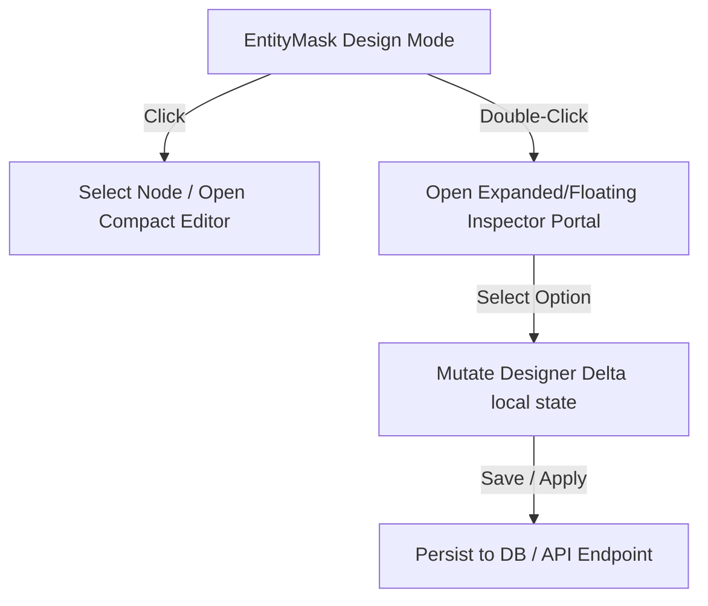

# Architecture & Code Review: Inline Designer Rework

This review evaluates the current implementation of the **Inline Designer** in the `slopware` repository against the design principles and specifications established in [.agents/11_designer_rework.md](11_designer_rework.md).

---

## 1. Core Vision & Concept Comparison

The goal of the designer rework is to replace heavyweight canvas-based layouts with a **compact, field-first metadata editor** operating directly on top of the live, active CRUD form. It must remain a visually lightweight overlay that configures predefined template metadata rather than redefining structural geometry.

### Active Strengths in the Code

- **Live CRUD Surface is Foreground**: The live form (`EntityMask`) remains fully interactive in design mode. This adheres to the rule that the designer must behave like a mode on top of the existing shell rather than a separate routing context.
- **No Layout Reflow**: The selection state in `EntityMask` uses inset rings (`ring-inset`) and background transitions that preserve physical height and width, respecting the constraint that _selection and overlays must not reflow the base document layout_.
- **Compact Overlay Placement**: The field editor overlay in `EntityMask` is portalled to `document.body` and positioned relative to the clicked element's bounding rect via a dynamic `getBoundingClientRect()` layout effect, preventing height expansion of the form.

---

## 2. In-Depth Component Analysis & Gaps

### A. The Structural Model (Frames & Fields)

The specification lays out a firm hierarchy:

> **Predefined Templates consisting of structural containers called `Frames` which hold ordered `Fields`. Every field must belong to exactly one frame.**

#### Code Gaps & Implementation Issues:

1. **Flat Grid Fallback**: Despite `designer-context.tsx` declaring frame operations (`moveFieldToFrame`, `addFrameDraft`, etc.) and computing `frameNodes`, the actual layout in `packages/ui/components/entity-mask.tsx` renders fields in a **single flat grid**:
   ```typescript
   // packages/ui/components/entity-mask.tsx (lines 890-928)
   <div className={cn("grid gap-x-6 gap-y-5", fieldGridClass)}>
     {effectiveFields.filter(visibleFieldInLiveView).map((field) => (
       ...
     ))}
   </div>
   ```
   There is **no physical division or frame containers rendered around fields** based on `frameKey` or `parentId` inside `EntityMask`.
2. **Ignored Templates**: The standard single vs. two-column CRUD templates are selected statically using local props (`layout`) rather than dynamic layouts derived from frame-level metadata.

---

### B. The Field Editing Overlay

The interactive contract states:

> **Click selects a node, double-click opens a compact edit overlay for the selected item, exposing controls for visibility, readonly state, labels, styles, and backing path mutations.**



#### Code Gaps & Implementation Issues:

1. **Duplicate Source Fields (UI Rendering Bug)**:
   In `packages/ui/components/entity-mask.tsx` inside `editorOverlay` (lines 1133–1194), the `Source` select (Schema vs. JSONB field) is **accidentally declared twice** in sequence.

   _First declaration (lines 1133–1155):_

   ```tsx
   <div className="grid gap-2 sm:grid-cols-2">
     <label className="flex flex-col gap-1">
       <span className="text-ink-muted text-[10px] font-semibold tracking-wide uppercase">
         Source
       </span>
       <select
         value={editorIsJsonb ? "jsonb" : "schema"}
         onChange={(e) => {
           if (e.target.value === "jsonb") {
             updateField(editorField.key, {
               path: editorField.jsonPath ?? `customAttributes.${editorField.key}`,
             });
             return;
           }
           updateField(editorField.key, { path: null });
         }}
         className="h-7 rounded-md border border-hairline bg-canvas px-2 text-[12px] text-ink outline-none"
       >
         <option value="schema">Schema field</option>
         <option value="jsonb">JSONB field</option>
       </select>
     </label>
   </div>
   ```

   _Second declaration (lines 1173–1194):_

   ```tsx
   <label className="flex flex-col gap-1">
     <span className="text-ink-muted text-[10px] font-semibold tracking-wide uppercase">
       Source
     </span>
     <select
       value={editorIsJsonb ? "jsonb" : "schema"}
       onChange={(e) => {
         if (e.target.value === "jsonb") {
           updateField(editorField.key, {
             path: editorField.jsonPath ?? `customAttributes.${editorField.key}`,
           });
           return;
         }
         updateField(editorField.key, { path: null });
       }}
       className="h-7 rounded-md border border-hairline bg-canvas px-2 text-[12px] text-ink outline-none"
     >
       <option value="schema">Schema field</option>
       <option value="jsonb">JSONB field</option>
     </select>
   </label>
   ```

   This duplicates rendering of the form element.

2. **Overlay Collision / Sidebar Overlap**:
   The floating overlay portal places the inspector dynamically relative to the field bounds. However, if the field sits on the right-hand column, the overlay portal visually overlaps with the sticky `InlineDesigner` sidebar panel.

---

### C. Formatting and Style Binding

The specification restricts styling to:

> **Label tone (default, muted, accent, danger), label style (normal, bold, italic), and a finite set of presentation tokens. Free-form CSS authoring and arbitrary color pickers are prohibited.**

#### Evaluation:

- **Fully Compliant**: The current codebase maps label styles exclusively through a curated set of classes:
  ```typescript
  const LABEL_TONE_CLASSES: Record<NonNullable<FieldDesignConfig["labelTone"]>, string> = {
    default: "text-ink-secondary",
    muted: "text-ink-muted",
    accent: "text-primary",
    danger: "text-destructive",
  };
  ```
  The editor overlay exposes exactly these classes via styled buttons, preventing arbitrary CSS injections or complex themes.

---

### D. JSONB Fields

The specification requires:

> **JSONB-backed fields behave like first-class fields, can be created/removed from the same layout, and bound to path validations before save.**

#### Code Gaps & Implementation Issues:

1. **No Backend or Schema Path Validation**: The backing path for JSONB is inputted via a standard text field (`backing path`). Changes are committed directly to `delta` without validating against the database schema or active entity contract.
2. **Mocked JSONB Introspection**: Introspection in the db package relies entirely on column-level mappings. There is no active analyzer in `MetadataResolver` to detect if nested JSONB paths exist or to auto-suggest valid deep path variables.

---

### E. Runtime & Persistence Contract

The platform integration contract dictates:

> **Activation via `CommandProvider`, focus tracking, active escape-key closing, and transaction-safe database mutations.**

#### Code Gaps & Implementation Issues:

1. **Mocked Client APIs**: The `designerClient` inside `inline-designer.tsx` (lines 43–59) is entirely mocked out:
   ```typescript
   const designerClient: DesignerClient = {
     async save(snapshot) { return snapshot; },
     async apply(snapshot) { return snapshot; },
     async reconcile(snapshot) { return snapshot; },
     ...
   };
   ```
   The database changes are instead applied by a parallel hook in `designer-context.tsx` (`persistActiveSurface`). This creates a confusing bifurcation of persistence pathways.
2. **Hard-coded Endpoint Routing**:
   Both `Save` and `Apply` actions inside `persistActiveSurface` map directly to the `/apply` POST request:
   ```typescript
   const response = await fetch(`/api/metadata/designer/${entityName}/${surface}/apply`, { ... })
   ```
   This negates the difference between saving local workspace drafts vs. applying overrides to base or organization levels.

---

## 3. Detailed Gap Checklist

| Specification Item                | Current Implementation Status                                          | Code Location               | Gap Severity |
| :-------------------------------- | :--------------------------------------------------------------------- | :-------------------------- | :----------- |
| **Field Ordering within Frames**  | Flat ordering working, Frame grouping ignored in UI                    | `entity-mask.tsx:L890`      | **Medium**   |
| **Field Visibility Toggle**       | Fully implemented                                                      | `entity-mask.tsx:L1009`     | _None_       |
| **Readonly and Required Toggles** | Fully implemented                                                      | `entity-mask.tsx:L1028`     | _None_       |
| **Label Tone & Styles**           | Fully implemented using curated classes                                | `entity-mask.tsx:L85`       | _None_       |
| **JSONB Field Creation**          | Supported in UI; missing schema validation                             | `entity-mask.tsx:L1118`     | **Low**      |
| **Floating Overlay Editor**       | Portalled UI implemented; has duplicate elements and sidebar collision | `entity-mask.tsx:L960`      | **Medium**   |
| **Frame Container Editing**       | Structural controls present; rendering is flat                         | `entity-mask.tsx:L1247`     | **High**     |
| **Save vs. Apply Separation**     | Both save and apply operations fall back to `/apply`                   | `designer-context.tsx:L958` | **Medium**   |

---

## 4. Key Recommendations & Action Plan

### 1. Fix the Duplicate Select Bug in `entity-mask.tsx`

Remove the second block of the `Source` select element between lines 1173 and 1194.

### 2. Introduce Structural Render Blocks for Frames

Rework the flattened list mapping in `EntityMask` to group inputs into physical frames using semantic `<fieldset>` or `<section>` wrappers based on `frameKey`/`parentId` configuration from `delta.fieldConfigs`. This will align layout geometry with the logical frames product model.

### 3. Implement Collision Guard on Floating Overlay Placement

Enhance the layout positioning logic in the `useLayoutEffect` of `entity-mask.tsx` to shift the overlay leftward or downward if it detects potential collisions with the right-docked inline designer panel.

### 4. Separate Save vs. Apply Persistence Paths

Update `persistActiveSurface` in `designer-context.tsx` to hit `/patch` for transient saves and `/apply` for committing mutations, enabling a robust draft-to-published cycle.
