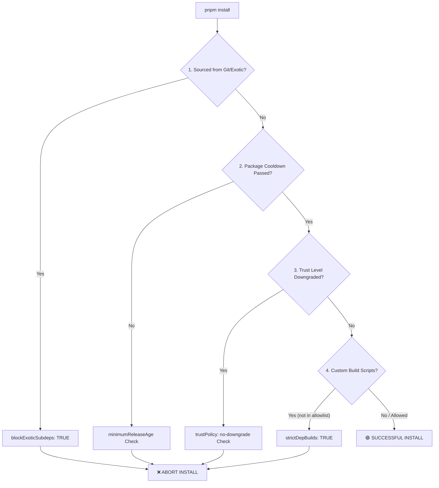

# Implementation Plan: Harden Repository with npm & pnpm Security Best Practices

> [!NOTE]
> This security plan is based on the [lirantal/npm-security-best-practices](https://github.com/lirantal/npm-security-best-practices) guide. It has been customized specifically for our **slopware** monorepo workspace which runs on **pnpm v11.1.1**.

We have analyzed our workspace configuration ([`pnpm-workspace.yaml`](file:///home/ubuntu/slopware/pnpm-workspace.yaml) and [`package.json`](file:///home/ubuntu/slopware/package.json)) to determine which of these best practices are already in place and how we can apply the remaining ones.

---

## 🛡️ Current Workspace Security Profile

Here is a summary of our current posture compared to the security guide:

| Best Practice Category               | Guide Recommendation                            | Our Current Setup                                    | Security Level | Action Required                                                       |
| :----------------------------------- | :---------------------------------------------- | :--------------------------------------------------- | :------------: | :-------------------------------------------------------------------- |
| **Disable Post-Install Scripts**     | Disable all build scripts or strictly allowlist | `allowBuilds` is active with only `esbuild` allowed. |  🟢 **Good**   | Enforce `strictDepBuilds: true`.                                      |
| **Block Git/Exotic Subdependencies** | Set `blockExoticSubdeps: true`                  | `blockExoticSubdeps: false`                          |  🔴 **Risky**  | Update temporary experimental better-auth adapter and flip to `true`. |
| **Publishing Trust Policy**          | Set `trustPolicy: no-downgrade`                 | Not configured                                       |  🟡 **Weak**   | Add `trustPolicy: no-downgrade` (pnpm 10.21+).                        |
| **Release Cooldown (Min Age)**       | Set `minimumReleaseAge`                         | Not configured                                       |  🟡 **Weak**   | Enable 7-to-30 day release cooldown.                                  |
| **Lockfile Hardening**               | Enforce frozen lockfile in CI                   | Standard lockfile in place                           |  🟢 **Good**   | Add `frozen-lockfile=true` to `.npmrc`.                               |

---

## 📈 Secure Dependency Resolution Workflow

Under our hardened configuration, `pnpm` will act as a strict gatekeeper for all dependencies entering our repository:



---

## 🛠️ Actionable Hardening Checklist

### 1. Hardening Lifecycle & Build Scripts (Disable Post-Install)

Since pnpm 10+, post-install lifecycle scripts are disabled by default. We currently have an allowlist defined in `pnpm-workspace.yaml`:

```yaml
allowBuilds:
  esbuild: true
  msw: false
```

> [!TIP]
> To prevent any unreviewed sub-dependencies from silently requesting builds (which normally outputs a warning), we should enforce strict build errors.

- **Action:** Add `strictDepBuilds: true` to [pnpm-workspace.yaml](file:///home/ubuntu/slopware/pnpm-workspace.yaml). This will fail installation if a new package attempts to execute arbitrary code during install that is not explicitly in `allowBuilds`.

---

### 2. Resolving the `@better-auth/drizzle-adapter` Exotic Dependency

Currently, we have `blockExoticSubdeps: false` because we are using a temporary PR build of `@better-auth/drizzle-adapter` from `pkg.pr.new` (exotic registry URL):

```yaml
# pnpm-workspace.yaml:L9-L13
# FIXME: Temporary workaround for experimental @better-auth/drizzle-adapter version,
# which is currently being published via pkg.pr.new in an ongoing pull request:
# https://github.com/better-auth/better-auth/pull/9489
# Remove this option once that PR is merged and published to npm.
blockExoticSubdeps: false
```

- **Security Risk:** Leaving `blockExoticSubdeps: false` allows other developers or subdependencies to introduce untrusted packages directly via Git or external HTTPS links, bypassing npm registry protections.
- **Action:**
  1. Monitor the Better Auth PR #9489. Once merged and published to npm, update [`pnpm-workspace.yaml`](file:///home/ubuntu/slopware/pnpm-workspace.yaml) catalog to a stable npm version (e.g. `^1.6.12`).
  2. Change `blockExoticSubdeps` to `true` to block future exotic packages.

---

### 3. Implementing Publishing Trust Policies (`trustPolicy`)

pnpm 10.21+ supports trust policies that verify package signatures and OIDC provenance.

- **Security Risk:** If a package developer's account is compromised, the attacker might publish a malicious version from their local machine without the standard GitHub OIDC / Trusted Publisher provenance.
- **Action:** Add trust policies to [pnpm-workspace.yaml](file:///home/ubuntu/slopware/pnpm-workspace.yaml):

  ```yaml
  # Reject a version whose publishing trust signals regressed
  trustPolicy: no-downgrade

  # Ignore check for packages older than 30 days (avoids issues with legacy packages)
  trustPolicyIgnoreAfter: 43200 # minutes (30 days)
  ```

---

### 4. Setting Up Cooldown Periods (`minimumReleaseAge`)

Supply chain attacks (malicious package releases) are usually reported and removed from the npm registry within 24-72 hours.

- **Security Risk:** Automatically updating to the absolute latest version of a dependency within minutes of its release exposes us to zero-day supply chain attacks.
- **Action:** Add `minimumReleaseAge` to [pnpm-workspace.yaml](file:///home/ubuntu/slopware/pnpm-workspace.yaml):
  ```yaml
  # Block packages published less than 7 days ago (10080 minutes) to allow cooldown
  minimumReleaseAge: 10080
  ```
  > [!NOTE]
  > While the guide suggests 30 days (`43200` minutes), a **7-day cooldown** (`10080` minutes) is a highly practical sweet spot for modern high-velocity development, allowing us to stay updated while mitigating zero-day malware.

---

### 5. Hardening Lockfiles and local `.npmrc`

We should ensure that our lockfile `pnpm-lock.yaml` cannot be modified silently during local dev checks or CI pipelines.

- **Action:** Enforce strict lockfile compliance. In our [`.npmrc`](file:///home/ubuntu/slopware/.npmrc), we should specify:
  ```ini
  # Enforce strict store check and prevent frozen-lockfile bypasses
  frozen-lockfile=true
  ```

---

## 📋 Recommended `pnpm-workspace.yaml` Diff

Below is the exact diff to fully apply these secure-by-default options to our workspace:

```diff
 packages:
   - apps/*
   - packages/*
   - tooling/*
 allowBuilds:
   esbuild: true
   msw: false

+# SECURITY: Fail the install if a dependency wants to run a build script
+# that isn't explicitly in the allow-list above
+strictDepBuilds: true
+
+# SECURITY: Reject a version whose publishing trust signals regressed (OIDC/Signatures)
+trustPolicy: no-downgrade
+trustPolicyIgnoreAfter: 43200
+
+# SECURITY: Block packages newer than 7 days to mitigate zero-day malware
+minimumReleaseAge: 10080
+
 # FIXME: Temporary workaround for experimental @better-auth/drizzle-adapter version,
 # which is currently being published via pkg.pr.new in an ongoing pull request:
 # https://github.com/better-auth/better-auth/pull/9489
 # Remove this option once that PR is merged and published to npm.
 blockExoticSubdeps: false
```

---

## 🚀 Execution & Timeline Plan

1. **Step 1 (Immediate):** Apply the non-breaking settings (`strictDepBuilds`, `trustPolicy`, `minimumReleaseAge`) directly to [`pnpm-workspace.yaml`](file:///home/ubuntu/slopware/pnpm-workspace.yaml).
2. **Step 2 (CI Hardening):** Verify that our CI builds execute with `pnpm install --frozen-lockfile` to prevent lockfile manipulation.
3. **Step 3 (Post-PR Cleanup):** Once the Better Auth PR is merged, clean up the catalog to use the stable npm registry package and change `blockExoticSubdeps` to `true`.
