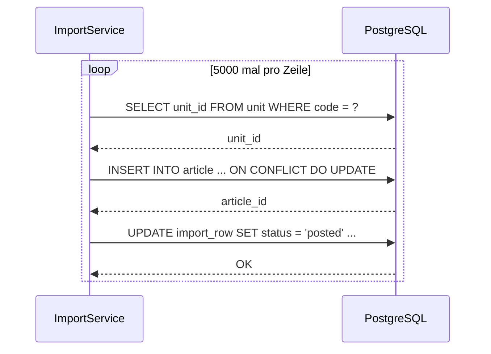

# Technische Analyse der slopware-Architektur & aktuellen Implementierung

Diese Analyse bietet eine tiefgehende und kritische Evaluierung der Architektur und Implementierung von **slopware**. Der Fokus liegt auf der Identifikation kritischer Performance-Flaschenhälse, Skalierungsproblemen, Sicherheitsrisiken und strukturellen Schwachstellen.

---

## 1. Management Summary

Die slopware-Plattform weist eine solide, metadatengetriebene Architektur auf, die auf PostgreSQL als „Source of Truth“ aufsetzt. Die konsequente Kapselung von Geschäftslogik in Services (`DataService`, `DocumentService`) und die Definition klarer Schnittstellen über das `Capability`-System bilden ein hervorragendes Fundament.

Dennoch existieren in der aktuellen Umsetzung **kritische Architektur- und Performance-Engpässe**, die bei steigender Datenmenge, zunehmender Tenant-Anzahl oder hoher Systemlast zu massiven Ausfällen führen können. Die schwerwiegendsten Risiken betreffen:
1. **N+1-Query-Verhalten bei Datenimporten**: Sequenzielle Datenbankzugriffe pro Datensatz in Schleifen.
2. **Globale Sperren und Lastspitzen bei Materialized Views (MVs)**: Synchroner Refresh aller MVs für *alle* Tenants bei jedem Buchungsvorgang.
3. **Sicherheitslücken beim RLS-Pilot**: Ein noch nicht aktivierter RLS-Zustand im Normalbetrieb, kombiniert mit potenziell instabilen Transaktionsschachtelungen.
4. **Massive Re-Render-Kaskaden im React-Frontend**: Durch ein unoptimiertes Zustandsmanagement im globalen `CommandProvider`.

---

## 2. Detaillierte Analyse kritischer Engpässe & Risiken

### 2.1. Re-Render-Kaskaden durch den `CommandProvider` (Frontend)

#### Status Quo
Jede Tastenkombination und Aktion im System ist über den globalen [CommandProvider](file:///home/ubuntu/slopware/packages/ui/platform/command-registry.tsx#L40) registriert. Komponenten melden ihre Commands beim Mounten über `registerCommand` im React-State `commands` an und entfernen sie beim Unmounten wieder. Der `CommandProvider` liegt an der Wurzel des App-Templates in `__root.tsx`.

#### Das Problem
In `registerCommand` wird der State direkt modifiziert:
```typescript
const registerCommand = useCallback((command: Command) => {
  setCommands((prev) => {
    if (prev.find((c) => c.id === command.id)) return prev;
    return [...prev, command];
  });
  return () => {
    setCommands((prev) => prev.filter((c) => c.id !== command.id));
  };
}, []);
```
Jedes Mal, wenn ein Modul (wie z. B. [addresses.tsx](file:///home/ubuntu/slopware/apps/web/src/routes/_auth/app/addresses.tsx)) geladen wird, registrieren dessen Subkomponenten (DataGrid, EntityMask, ActionBar, NavigationTree) jeweils mehrere Commands. Jede Registrierung führt zu einem State-Update des `CommandProvider`. 
Dies löst eine **Kaskade aufeinanderfolgender Re-Renders der gesamten App-Struktur** aus (oft 10 bis 20 Render-Zyklen direkt beim Laden einer Seite). 

> [!WARNING]
> Dies führt bei komplexen Masken zu spürbaren Rucklern (Micro-Stuttering) und verlangsamt die Navigation erheblich, da das gesamte UI-Chrome und alle registrierten Tastatur-Handler synchron neu gerendert werden müssen.

#### Empfohlene Behebung
- **Ref-basiertes Registrierungs-Management**: Verwenden eines `useRef` anstelle des React-State für die interne Liste der ausführbaren Commands. 
- **Entkopplung der Reaktivität**: Komponenten, die lediglich Commands ausführen (z. B. Tastatur-Handler), müssen nicht auf die Liste aller Commands lauschen. Nur reaktive Komponenten wie die `ActionBar` oder der Shortcuts-Spickzettel abonnieren gezielte Updates, idealerweise über einen schlanken Event-Emitter oder ein Zustandssystem mit feingranularen Selektoren (z. B. *Zustand* oder *Zustand-Slices*).

---

### 2.2. N+1-Query-Problematik bei Batch-Importen (Backend / `ImportService`)

#### Status Quo
Der [ImportService](file:///home/ubuntu/slopware/packages/db/src/services/import-service.ts) verarbeitet Import-Dateien aus Fremdsystemen (wie Büroware) in Chunks. In der Methode [resolveBuerowareBatch](file:///home/ubuntu/slopware/packages/db/src/services/import-service.ts#L1698) werden Datensätze seitenweise geladen. Für jeden einzelnen Datensatz wird jedoch sequenziell [upsertBuerowarePayload](file:///home/ubuntu/slopware/packages/db/src/services/import-service.ts#L1949) aufgerufen.

#### Das Problem
Innerhalb von `upsertBuerowarePayload` und beim Posten von Importzeilen in `postBatch` führt das System für *jeden Datensatz* separate Einzelschritte aus:
1. `resolveUnitIdByCode` / `resolveArticleIdByNo` (Einzelselektierung zur Auflösung von IDs).
2. `db.insert(...).onConflictDoUpdate(...)` (Einzel-Upsert).
3. `db.update(importRow).set(...)` (Einzelnes Update des Verarbeitungsstatus).
4. `registerExternalMapping(...)` (Einzel-Eintrag für Synchronisation).

Bei einer Datei mit 5.000 Artikeln führt dies zu **über 15.000 sequenziellen Datenbank-Roundtrips** über die Anwendungsschicht.



> [!CAUTION]
> Das Ausführen dieser Schleife blockiert Threads, erhöht die Latenz dramatisch und führt bei größeren Importdateien unweigerlich zu **HTTP-Gateway-Timeouts (504)**. Zudem blockiert es DB-Verbindungen im Pool unnötig lange.

#### Empfohlene Behebung
- **Bulk-Auflösung**: Vorab-Laden aller benötigten Einheiten (`unit`) und Artikelgruppen (`articleGroup`) des aktuellen Mandanten in eine Map (In-Memory Lookup), bevor die Schleife startet.
- **Bulk-Upsert / Bulk-Update**: Nutzung von Drizzles Bulk-Insert-Fähigkeiten:
  ```typescript
  await db.insert(article).values(batchOfArticles).onConflictDoUpdate(...)
  ```
- **Batch-Status-Updates**: Sammeln aller erfolgreichen `rowId`s und Ausführen eines einzigen `inArray`-Updates auf `import_row` am Ende jeder Seite (z. B. alle 1000 Zeilen).

---

### 2.3. Performanz und Sperren bei Synchroner MV-Aktualisierung (Statistiken)

#### Status Quo
Nach dem Buchen eines Dokuments in `postDocument` wird die Funktion [refreshStatisticsMVs](file:///home/ubuntu/slopware/packages/db/src/services/statistics.ts#L5) aufgerufen:
```typescript
export async function refreshStatisticsMVs(_tenantId?: string): Promise<void> {
  await db.execute(sql`REFRESH MATERIALIZED VIEW CONCURRENTLY mv_sales_period`);
  await db.execute(sql`REFRESH MATERIALIZED VIEW CONCURRENTLY mv_sales_period_customer`);
  await db.execute(sql`REFRESH MATERIALIZED VIEW CONCURRENTLY mv_sales_period_article`);
}
```

#### Das Problem
1. **Globale Rebuild-Last**: Da es sich um globale Materialized Views handelt, berechnet PostgreSQL bei jedem Aufruf die Verkaufsstatistiken über **alle Buchungszeilen aller Tenants hinweg** komplett neu.
2. **Gleichzeitige Sperren**: Das Schlüsselwort `CONCURRENTLY` verhindert zwar Lese-Blockaden, benötigt jedoch einen eindeutigen Index und erzeugt dennoch erhebliche Schreib- und I/O-Last. Wenn mehrere Tenants gleichzeitig Rechnungen buchen, staut sich der Refresh-Prozess in der DB auf (Lock-Contention auf die MVs).
3. **Synchroner Request-Kontext**: Der Aufruf blockiert den Buchungsprozess in der Anwendung, da auf die Ausführung gewartet wird (oder er läuft unkontrolliert als Fire-and-Forget-Promise im Hintergrund, was den Node.js-Prozess bei Fehlern instabil machen kann).

#### Empfohlene Behebung
- **Asynchroner Event-basierten Refresh**: Anstatt die MVs direkt im HTTP-Request zu refreshen, sollte ein Eintrag in eine Job-Warteschlange geschrieben oder ein PG `NOTIFY` abgesetzt werden. Ein Hintergrundprozess (Worker) führt den Refresh gesammelt und gedrosselt (Rate-Limiting, z. B. maximal einmal alle 5 Minuten) aus.
- **Inkrementelle Aggregation**: Langfristig sollten Materialized Views durch physische, aggregierte Statistik-Tabellen ersetzt werden, die transaktional via Datenbank-Trigger bei neuen `fact_sales_event`-Einträgen per Delta-Update aktualisiert werden (z. B. `UPDATE sales_stats SET total = total + :delta WHERE ...`).

---

### 2.4. RLS-Pilot: Inaktive Isolation & Transaktions-Konflikte (Sicherheit)

#### Status Quo
Die Row-Level-Security (RLS) wurde in einer [Pilot-Migration](file:///home/ubuntu/slopware/packages/db/migrations/20260613173607_rls_pilot/migration.sql) für 5 Kerntabellen eingeführt. Sie basiert auf dem Session-GUC `app.tenant_id`. 
In [execute.ts](file:///home/ubuntu/slopware/packages/db/src/capabilities/core/execute.ts#L257) wird dies wie folgt eingebunden:
```typescript
if (process.env.CAPABILITY_RLS === "1") {
  return dbTransaction(async (tx) => {
    await tx.execute(sql`select set_config('app.tenant_id', ${ctx.tenantId}, true)`);
    return runWithDbTx(tx, run);
  });
}
```

#### Das Problem
1. **Dormant-Status**: Die RLS-Richtlinien sind standardmäßig inaktiv, da `CAPABILITY_RLS` in der `.env` nicht flächendeckend gesetzt ist. Das bedeutet, dass der gesamte Mandantenschutz im Echtbetrieb rein auf Applikationsebene (`where tenantId = ...`) beruht. Vergisst ein Entwickler diese Klausel bei einer neuen Funktion, kommt es zum Datenleck.
2. **Gefahr von Verbindungs-Leaks und RLS-Bypass durch verschachtelte Transaktionen**: 
   - `executeCapability` öffnet über `dbTransaction` eine Transaktion auf der Root-Verbindung (`baseDb`).
   - Die Services (z. B. `DocumentService.postDocument`) rufen im Handler jedoch eigenständig `db.transaction(...)` auf.
   - Drizzles Proxy-Mechanismus (`db` Proxy) leitet dies zwar über die `AsyncLocalStorage`-Instanz an die aktive Transaktion weiter (Savepoint). 
   - Falls jedoch an irgendeiner Stelle versehentlich `dbTransaction` (also die ungekapselte Root-Verbindung) aufgerufen wird, bricht die Abfrage aus dem RLS-Kontext aus, läuft auf einer separaten Connection ohne den gesetzten GUC `app.tenant_id` und hebelt die RLS-Sicherheit lautlos aus.

#### Empfohlene Behebung
1. **Vollständiges Enforcement**: RLS sollte nicht als optionaler Schalter existieren. `CAPABILITY_RLS=1` muss zwingend vorausgesetzt werden.
2. **Applikations-Verbindung anpassen**: Der Datenbankbenutzer für die reguläre Webanwendung darf nicht die Eigentümer-Rolle der Tabellen sein. Die Tabellen-Eigentümer (z. B. für Migrationen) umgehen RLS standardmäßig. Die App muss sich als eingeschränkte Rolle (z. B. `app_runtime`) verbinden, bei der RLS erzwungen wird.
3. **Automatisches Transaktions-GUC-Handling**: Anstelle eines manuellen `set_config` in `executeCapability` sollte das Setzen von `app.tenant_id` tief im Connection-Pooling-Prozess der DB-Bibliothek verankert werden (z. B. bei jedem `connection.acquire` oder als Drizzle-Middleware), um sicherzustellen, dass keine Abfrage den GUC umgehen kann.

---

### 2.5. Indexfreie dynamic `OR` / `ILIKE`-Suchen in `DataService`

#### Status Quo
In [DataService.list](file:///home/ubuntu/slopware/packages/db/src/services/data.ts#L261) wird die Freitextsuche dynamisch generiert. Alle Spalten, die keine IDs sind und vom Typ `string` oder `json` sind, werden in eine `OR`-Kette überführt:
```typescript
const searchableCols = Object.entries(getColumns(table)).filter(([name, col]) => {
  if (name === "id" || name.endsWith("Id")) return false;
  return (col as any).dataType === "string" || (col as any).dataType === "json";
});
if (searchableCols.length > 0) {
  conditions.push(
    or(
      ...searchableCols.map(([, col]) => {
        const expr = (col as any).dataType === "json" ? sql`${col}::text` : (col as any);
        return ilike(expr as any, term);
      }),
    )!,
  );
}
```

#### Das Problem
1. **Full-Table-Scans**: Ein `ILIKE` mit führendem Wildcard (`%term%`) kann Standard-B-Tree-Indizes in PostgreSQL nicht nutzen.
2. **JSON-Casting-Overhead**: Das Umwandeln von `custom_attributes` (JSONB) in Text (`col::text`) bei jeder Suchanfrage verhindert jegliche Indexnutzung vollends. Bei Tabellen mit zehntausenden Zeilen führt jede Suchanfrage im UI zu einem extrem teuren Full-Table-Scan unter maximaler CPU-Last auf der Datenbank.
3. **Verlust der Abfrageplan-Cachebarkeit**: Da sich die Anzahl und Struktur der Suchbedingungen dynamisch ändert, kann PostgreSQL die Ausführungspläne für diese Abfragen nicht effizient cachen.

#### Empfohlene Behebung
- **Spezifische Suchspalten**: Anstatt willkürlich alle Text- und JSON-Spalten zu durchsuchen, sollte das Introspektions-Metadatensystem explizit definieren, welche Felder suchbar sind (z. B. nur `articleNo` und `name`).
- **PostgreSQL Trigram-Indizes**: Erstellung von `pg_trgm`-Indizes auf den relevanten Suchfeldern, um `ILIKE`-Suchen zu beschleunigen:
  ```sql
  CREATE EXTENSION pg_trgm;
  CREATE INDEX idx_article_name_trgm ON article USING gin (name gin_trgm_ops);
  ```
- **Dedizierte Such-Engine**: Bei sehr großen Datenbeständen sollte die Freitextsuche aus der relationalen DB auf eine Suchdatenbank (z. B. Elasticsearch, OpenSearch) oder PostgreSQL-Volltextsuche (`tsvector`) ausgelagert werden.

---

### 2.6. Prompt-Größe und Token-Verschwendung im AI-Planning

#### Status Quo
Beim Erstellen eines Ausführungsplans im [AIPlanningService](file:///home/ubuntu/slopware/packages/db/src/services/ai-planning.ts#L82) liest der Service alle semantischen Entitäten, Beziehungen, Befehle und Felder für den aktuellen Mandanten und baut diese als Text in den System-Prompt ein.

#### Das Problem
Das System übermittelt bei *jeder einzelnen* Anfrage den kompletten Katalog aller Tabellen, Felder und Zod-Validierungsschemata an das LLM.
- **Steigende Kosten & Latenz**: Mit dem Wachstum des slopware-ERP-Systems wächst der Katalog exponentiell. Die Prompt-Größe überschreitet schnell 20.000 Token, was die API-Kosten in die Höhe treibt und die Antwortzeit des Modells spürbar erhöht.
- **Kontext-Verwässerung (Attention Lost)**: Je mehr unbeteiligte Felder und Validierungen im Prompt stehen (z. B. Logistikdaten, obwohl der Nutzer eine Buchungsadresse anlegen möchte), desto unpräziser wird das Planungsverhalten des LLMs.

#### Empfohlene Behebung
- **Zweistufige Tool-Auswahl (Vector Search / RAG)**: Integration eines Vector-Index für Capabilities und Schemata. Der Benutzer-Prompt wird zuerst gegen den Index abgefragt, um nur die Top-5 der wahrscheinlich benötigten Capabilities und Entitäten zu ermitteln. Nur diese verfeinerten Metadaten werden in den LLM-Context gepackt.
- **Dynamisches Lazy-Loading von Tools**: Das Modell startet mit einem minimalen Basissatz an Analyse-Tools und fordert bei Bedarf über ein Tool wie `get_entity_schema(name)` gezielt weitere Schemadetails an (entspricht dem in `CONTEXT.md` erwähnten optionalen Pfad „Lazy Tool Discovery“).

---

## 3. Empfohlene Roadmap & Priorisierung

| Priorität | Bereich | Maßnahme | Aufwand | Auswirkung |
| :--- | :--- | :--- | :--- | :--- |
| **P0 (Kritisch)** | Datenbank / Import | Umstellung des `ImportService` (Bulk-Upsert für Artikel/Adressen, Bulk-Update für `import_row`, In-Memory-Lookup für FKs) zur Vermeidung von 504 Timeouts. | Mittel | **Sehr hoch** |
| **P0 (Sicherheit)** | Sicherheit / RLS | RLS standardmäßig erzwingen (`CAPABILITY_RLS=1`) und Absicherung der Transaktionsverschachtelungen durch Middleware-basiertes Setzen von `app.tenant_id`. | Gering | **Sehr hoch** |
| **P1 (Hoch)** | Frontend | Refaktorisierung des `CommandProvider` zur Vermeidung von Kaskaden-Renders. Umstellung auf Ref-basiertes Zustands-Caching. | Mittel | **Hoch** (UX) |
| **P1 (Hoch)** | Datenbank / MV | Auslagern des `refreshStatisticsMVs` in einen asynchronen, gedrosselten Hintergrund-Job via Job-Queue. | Mittel | **Hoch** (Lastreduktion) |
| **P2 (Mittel)** | Datenbank / Suche | Entfernen von `json::text` aus den dynamischen `ILIKE`-Bedingungen in `DataService.list` und Anlage von Trigram-Indizes auf Primär-Suchfeldern. | Gering | **Mittel** |
| **P2 (Mittel)** | AI-Service | Selektive Reduzierung des Prompts im `AIPlanningService` durch Relevanzfilterung anstelle des Ladens aller Metadaten. | Mittel | **Mittel** |

---
*Bericht erstellt am 16. Juni 2026 für psykeat/slopwareV1.*
