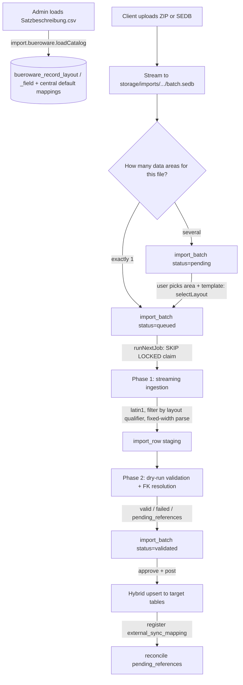

# Büroware ERP Import System — Technical Specification

This document describes the **implemented** architecture, database schema, parser algorithms, and capability/UI contracts for the multi-tenant Büroware ERP import pipeline. It reflects the catalog-first reimplementation of 2026-06-15. Where it disagrees with older revisions, this document wins.

Source of truth in code:

- Service: `packages/db/src/services/import-service.ts`
- Capabilities: `packages/db/src/capabilities/modules/import.core.ts`
- Schema: `packages/db/src/schema/app.schema.ts`
- Upload endpoint: `apps/web/src/routes/api/import/bueroware/upload.ts`
- UI: `apps/web/src/routes/_auth/app/import.tsx`

---

## 1. Problem Statement & Context

Büroware ERP exports master and transactional data as positional, fixed-width `.SEDB` files governed by the `Satzbeschreibung.csv` metadata schema.

- **Encoding (critical)**: SEDB and `Satzbeschreibung.csv` are **CP1252** (Windows-1252), not UTF-8. `Satzbeschreibung.csv` is **comma-delimited**. Reading an SEDB as UTF-8 corrupts umlauts _and_ shifts every fixed-width position (1 byte ≠ 1 char), so the parser must read **`latin1`**.
- **Data areas (`Datenbereich`)**: Each file maps to one or more _data areas_, identified by `Satzkürzel` (qualifier). A single file can expose several:

  | File                | Data areas (`Satzkürzel`, field count)                       |
  | ------------------- | ------------------------------------------------------------ |
  | `S_RART_R00.SEDB`   | Artikel (`S`, 645) · Warengruppe (`W`, 46) · Lager (`l`, 27) |
  | `S_RPER_R00.SEDB`   | Adressen (`S`, 456) · Lieferadressen (`L`, 65)               |
  | `S_RBEL_R00.SEDB`   | Belege (`*`, 702)                                            |
  | `S_RPOS30_R00.SEDB` | Positionen (`*`, 93)                                         |
  | `S_RANP_R00.SEDB`   | Ansprechpartner (`A`, 102)                                   |

  When a file has multiple data areas, the user **chooses the data area first**. `Satzkürzel = *` means an unqualified file (no leading qualifier, absolute positions).

- **Relative vs. absolute offsets**: For qualified data areas, character offset `0` is the qualifier and `Pos = 1` starts at offset `1`. For unqualified `*` areas, positions are absolute and `Pos = 0` is the first character. Blank `Pos`/`Länge` are derived from the trailing `_<pos>_<len>` of the `FeldId` (e.g. `ART_1_25`).
- **Idempotency**: Imports are re-run; upserts key on the source business key (e.g. `articleNo`, `addressNo`) and are recorded in `external_sync_mapping`.
- **FK resolution (Stammbezüge)**: References (e.g. article → Warengruppe) may arrive out of order; unresolved references park as `pending_references` and are retried by the reconcile job.

---

## 2. Architectural Overview

The system is **catalog-first**: the Satzbeschreibung is persisted once as central reference data; tenants then bind uploaded files to a data area and a field assignment, and the file is processed in two asynchronous phases.



### Phase 1 — Streaming Ingestion & Staging

- The upload streams to disk; ZIP is unpacked server-side (exactly one `.sedb`).
- The worker reads the file as **`latin1`**, line by line.
- It processes only lines belonging to the **chosen data area** (the layout's single qualifier); for unqualified `*` layouts it parses every line with absolute positions.
- Rows without a populated business key are discarded.
- Accepted rows are written in 1,000-row chunks to `import_row`. No core tables are touched in Phase 1.

### Phase 2 — Resolution & Posting

- Staging rows are processed in 1,000-row chunks.
- Reference fields are resolved through `external_sync_mapping`; misses park as `pending_references`.
- Dry-run writes validation outcomes back to `import_row`. Production performs a hybrid upsert (native columns + `custom_attributes` JSONB) and registers the new keys.

---

## 3. Satzbeschreibung Catalog (central reference data)

`import.bueroware.loadCatalog` (admin, `llm:hidden`) parses the **entire** `Satzbeschreibung.csv` (comma-delimited) into two **global, non-tenant** tables and generates a central default mapping per data area. It is re-runnable: each load deactivates prior layouts/defaults and bumps `catalog_version`.

Columns used from the CSV: `Datenbereich`, `Satzkürzel`, `Datei`, `Bezeichnung`, `Feldinhalt` (sample value), `Pos`, `Länge`, `Formatierung`, `FeldId`, `Refreshtabelle`, `Importkennzeichen`, `Laufende Nummer`. Rows are grouped by `(Datei, Satzkürzel)`; rows without a `FeldId` are skipped (CSV artifacts).

> The provided file is CP1252 — the loader expects correctly decoded text (the upload reads it as latin1 before passing it in). The header matcher tolerates `Satzkürzel`/`Länge` spellings (`satzkuerzel`, `laenge`, `length`, `qualifier`).

### Known-field dictionary

`BUEROWARE_FIELD_CATALOG` (in `import-service.ts`) maps a Büroware `FeldId` to a native target column; any field with a hit gets a `default_target_field` (others stay `null` → optional, assigned by the user). Representative entries:

| FeldId                                    | Target                                           | Notes                      |
| ----------------------------------------- | ------------------------------------------------ | -------------------------- |
| `ART_1_25`                                | `articleNo`                                      | required                   |
| `ART_36_5`                                | `articleGroupId`                                 | references `article_group` |
| `ART_51_60`                               | `name`                                           | required                   |
| `ART_138_8`                               | `supplierId`                                     | references `address`       |
| `ADR_2_8`                                 | `addressNo`                                      | required                   |
| `ADR_20_30`                               | `companyName`                                    |                            |
| `ADR_80_30` / `ADR_110_10` / `ADR_120_30` | `addressLine1` / `postalCode` / `city`           |                            |
| `WGR_1_5`                                 | `code`                                           | required                   |
| `BEL_2_1` / `BEL_3_8` / `BEL_19_10` …     | `documentType` / `documentNo` / `documentDate` … |                            |
| `POS_2_1` / `POS_3_8` / `POS_11_6` …      | `documentType` / `documentNo` / `lineNo` …       |                            |

Anything without a dictionary hit is left unmapped in the catalog; the assignment mask lets the user route it to a native column or to `customAttributes.<key>`.

### Data area → target entity

Stored on the layout as `default_target_entity` (snake_case pipeline form); the UI converts to the camelCase metadata entity for `getEffectiveFields`.

| Datenbereich    | Target entity           |
| --------------- | ----------------------- |
| Artikel         | `article`               |
| Warengruppe     | `article_group`         |
| Adressen        | `address`               |
| Lieferadressen  | `delivery_address`      |
| Ansprechpartner | `address_contact`       |
| Belege          | `document`              |
| Positionen      | `document_line`         |
| Lager           | _(none — user assigns)_ |

---

## 4. Database Schema

### A. Catalog tables (global, not tenant-scoped)

```typescript
export const buerowareRecordLayout = pgTable(
  "bueroware_record_layout",
  {
    layoutId: uuid("layout_id")
      .primaryKey()
      .default(sql`uuidv7()`),
    fileName: text("file_name").notNull(), // normalized UPPERCASE, e.g. S_RART_R00.SEDB
    dataArea: text("data_area").notNull(), // Datenbereich, e.g. "Artikel"
    qualifier: text("qualifier"), // Satzkürzel; '*' stored as NULL (unqualified)
    defaultTargetEntity: text("default_target_entity"),
    catalogVersion: integer("catalog_version").notNull().default(1),
    isActive: boolean("is_active").notNull().default(true),
    fieldCount: integer("field_count").notNull().default(0),
    createdAt: timestamp("created_at", { withTimezone: true }).notNull().defaultNow(),
  },
  (t) => [
    unique("uq_bueroware_layout_file_qualifier_version").on(
      t.fileName,
      t.qualifier,
      t.catalogVersion,
    ),
    index("idx_bueroware_layout_file_active").on(t.fileName, t.isActive),
  ],
);

export const buerowareRecordField = pgTable(
  "bueroware_record_field",
  {
    fieldId: uuid("field_id")
      .primaryKey()
      .default(sql`uuidv7()`),
    layoutId: uuid("layout_id")
      .notNull()
      .references(() => buerowareRecordLayout.layoutId),
    buerowareFieldId: text("bueroware_field_id").notNull(), // FeldId, e.g. ART_1_25
    label: text("label"), // Bezeichnung
    sampleValue: text("sample_value"), // Feldinhalt (example for the UI)
    position: integer("position"),
    length: integer("length"),
    formatting: text("formatting"), // L, R0, R2, AJN, ...
    refreshTable: text("refresh_table"), // Refreshtabelle (FK metadata)
    importMarker: text("import_marker"), // Importkennzeichen
    ordinal: integer("ordinal"), // Laufende Nummer
    defaultTargetField: text("default_target_field"), // central default target (or null)
    defaultReferenceEntity: text("default_reference_entity"),
    createdAt: timestamp("created_at", { withTimezone: true }).notNull().defaultNow(),
  },
  (t) => [index("idx_bueroware_field_layout").on(t.layoutId)],
);
```

### B. Reused mapping tables (the template/assignment layer)

The field assignment reuses the existing import tables rather than introducing parallel ones:

- **`import_profile`** — a named tenant **import template** (Importvorlage).
- **`import_profile_mapping_version`** — a versioned assignment. Gained **`layout_id`** (FK → `bueroware_record_layout`). The unique key is now `(source_system, source_file_name, layout_id, version_no)`. The **central default** per layout is a row with `tenant_id NULL`, `source_system = 'bueroware'`, `is_active = true`.
- **`import_field_mapping`** — one row per assigned field (position, length, qualifier, formatting, `source_field` = FeldId, `target_field` = native column or `customAttributes.<key>`, `target_entity`, `reference_entity`, `is_required`). `tenant_id` is nullable (central defaults have it null).
- **`import_batch`** — gained **`layout_id`** (which data area was chosen). `status ∈ {pending, queued, processing, validating, validated, approved, posted, failed, rejected}`.
- **`import_row`** — `payload` JSONB, `status ∈ {pending, valid, posted, failed, pending_references}`, `missing_references`, `error_detail`.
- **`external_sync_mapping`** — central idempotency/reference dictionary (`source_system`, `entity_type`, `external_id` → `internal_id`); `sales_channel_id` nullable for direct ERP uploads.

> Three assignment levels, one set of tables: **central default** (`tenant_id NULL`, per layout) → **tenant template** (`import_profile` + version) → **per-batch binding** (`import_batch.mapping_version_id`). Resolution order when binding a batch: explicit `mapping_version_id` → active tenant template for the layout → central default for the layout.

### Migrations

- `20260614120000_bueroware_import` — original staging/mapping evolution (applied).
- `20260615120000_bueroware_catalog` — catalog tables + `layout_id` columns + widened unique index.

There is **no `migrations/meta/_journal.json`**, so `pnpm db migrate` is a no-op. Apply migration SQL directly with `psql "$DATABASE_URL" -f <dir>/migration.sql` (migrations are written idempotent with `IF NOT EXISTS`). `pnpm db generate` emits a spurious drift migration — delete it.

---

## 5. Upload & Data-Area Workflow

`POST /api/import/bueroware/upload` (query: `fileName`, optional `layoutId`, `profileId`, `mappingVersionId`):

1. Authenticate + resolve tenant context (server-side; never trust client `tenantId`).
2. Stream the body to `storage/imports/<tenantId>/<batchId>.sedb`. If ZIP (`application/zip` or `.zip`), unpack server-side and require exactly one `.sedb`; the inner filename drives detection.
3. Call `queueBuerowareFile`, then return `{ batchId, status, needsLayoutSelection, layouts }` (always includes the file's data areas).

`queueBuerowareFile` resolves the data area:

- explicit `layoutId`, else the file's single active layout → `status = 'queued'` with the resolved mapping version bound;
- multiple layouts and no choice → `status = 'pending'`, `needsLayoutSelection = true`.

`selectBuerowareLayout({ batchId, layoutId, profileId?, mappingVersionId? })` (capability `import.bueroware.selectLayout`) binds the chosen data area + mapping source to a `pending`/`queued` batch, sets `target_entity` from the layout, and flips it to `queued`.

---

## 6. Field Assignment (central default · templates · override) + UI

The assignment is a **hybrid mask**: each catalog field on the left (label, FeldId, **sample value**, position/length) against the tenant target field on the right.

- `getLayoutFields(layoutId, { mappingVersionId? | templateProfileId? })` (capability `import.bueroware.getLayoutFields`) returns every catalog field joined with the resolved assignment (`included`, `targetField`, `referenceEntity`) plus `targetFields` — the effective tenant columns from `MetadataResolver.getEffectiveFields(metadataEntity)`.
- `listBuerowareTemplates(layoutId)` / `saveBuerowareTemplate({ layoutId, label, fields })` — list and persist tenant templates. Saving creates/updates an `import_profile` and a new active mapping version with `import_field_mapping` rows for the selected fields (positional metadata copied from the catalog).
- **Override model**: switching the template dropdown re-binds via `selectLayout` with the chosen `profileId`; "save as template" persists per-field edits. (Pure _unsaved_ per-import edits are not yet applied — save a template and select it.)

UI (`import.tsx`, `BuerowareAssistant` → `FieldAssignmentMask`): upload → data-area picker (when several) → hybrid mask with template dropdown, include checkboxes, field filter, "save as template", and **Importieren** (which calls `selectLayout` then `runNextJob`). Not every field must be shown or imported. The CSV import path (`UploadModal`, `tenantConnectorMapping`) is untouched.

---

## 7. Phase 1 — Ingestion (latin1, single-qualifier)

`ingestBuerowareBatchFile(batch)` resolves the mapping version from `batch.mappingVersionId` → central default for `batch.layoutId` → legacy lookup by `sourceFileName`. A mapping version maps exactly **one** data area, so all its `import_field_mapping` rows share one qualifier.

```typescript
const layout = batch.layoutId ? await getLayout(batch.layoutId) : undefined;
const qualifier =
  layout?.qualifier ?? mappings.map((m) => m.qualifier).find((q) => q !== null) ?? null;
const isUnqualifiedFile = qualifier === null;
const targetEntity = normalizeTargetEntity(
  layout?.defaultTargetEntity ?? batch.targetEntity ?? "article",
);

// CP1252 fixed-width → read latin1 so 1 byte = 1 char.
const rl = readline.createInterface({
  input: createReadStream(batch.filePath, { encoding: "latin1" }),
  crlfDelay: Infinity,
});

for await (const line of rl) {
  if (!line.trim()) continue;
  let data = line;
  if (!isUnqualifiedFile) {
    if (line.length < 1 || line.charAt(0) !== qualifier) continue; // other areas + header rows
    data = line.slice(1); // qualified positions are relative to the char after the qualifier
  }
  const payload: Record<string, unknown> = {};
  for (const m of mappings) {
    if (m.position === null || m.length === null) continue;
    const start = isUnqualifiedFile ? Math.max(m.position, 0) : Math.max(m.position - 1, 0);
    const raw = start >= data.length ? "" : data.substring(start, start + m.length);
    const parsed = parseFixedWidthValue(raw, m.formatting, m.defaultValue);
    if (m.targetField.startsWith("customAttributes.")) {
      const key = m.targetField.slice("customAttributes.".length);
      payload.customAttributes = { ...(payload.customAttributes ?? {}), [key]: parsed };
    } else payload[m.targetField] = parsed;
  }
  if (!isFilledBusinessKey(targetEntity, payload)) continue;
  rowBuffer.push({ tenantId, batchId, targetEntity, status: "pending", payload });
  // flush in 1,000-row chunks
}
```

`parseFixedWidthValue` applies `Formatierung`: `AJN` → boolean (`J/Y/1/TRUE/WAHR`), `R0` → integer, `R`/`R2` → float (European `,` → `.`), else trimmed string.

`runNextBuerowareImportJob` claims the oldest `queued` batch with `FOR UPDATE SKIP LOCKED`, then **re-selects it through the ORM** (raw `RETURNING` rows are snake_case), runs Phase 1, and a dry-run Phase 2.

---

## 8. Phase 2 — FK Resolution, Validation, Hybrid Upsert

`resolveBuerowareBatch(batchId, { dryRun })` processes `import_row` in 1,000-row chunks:

1. For each `reference_entity` field, look up `external_sync_mapping` (`tenant`, `source_system='bueroware'`, `entity_type`, `external_id`) in bulk. Misses → `missing_references`, status `pending_references`.
2. Validate the resolved payload (Zod per entity). Failures → `failed` + `error_detail`.
3. Dry-run → status `valid`. Production → hybrid upsert (native columns directly, the rest into `custom_attributes`), then register the new key in `external_sync_mapping`.

`postBatch` runs production Phase 2 for an `approved`/`validated` batch and, after posting, triggers reconcile.

> **Implemented post targets**: `article`, `address`, `article_group`. `document` / `document_line` / `delivery_address` / `address_contact` are cataloged and assignable but not yet upserted (see §11).

---

## 9. Batch Lifecycle

```
[ Upload ] → pending? --(selectLayout)--> queued
queued --(runNextJob: SKIP LOCKED)--> processing --(Phase 1 + dry-run Phase 2)--> validated
validated --(approve)--> approved --(post, isDryRun=false)--> posted
                                                   └─ failures: failed
```

`import_row` rows carry `valid` / `failed` / `pending_references` / `posted`.

---

## 10. Event-Driven Reconciliation

`reconcilePendingRows()` (capability `import.bueroware.reconcile`) resolves out-of-order imports:

1. Select all `import_row` with `status = 'pending_references'` for the tenant, grouped by batch.
2. Re-resolve each batch's reference fields (mapping version from the batch's `mapping_version_id` or central default for its `layout_id`).
3. Rows whose references now resolve are re-validated and posted; batch counts updated.

This is auto-triggered after a successful production post (new keys land in `external_sync_mapping`).

---

## 11. Capabilities & Known Gaps

**Capabilities** (`import.bueroware.*`): `loadCatalog`, `listLayouts`, `getLayoutFields`, `listTemplates`, `saveTemplate`, `selectLayout`, `queueFile`, `runNextJob`, `reconcile` (+ legacy per-profile `bootstrap`). Batch lifecycle via `import.importBatch.{list,get,approve,post,upload}`. All testing goes through the capability surface (`executeCapability` / `POST /api/capabilities/{key}/execute`) — no auth bypass, never put `tenantId` in capability input.

**Known gaps / follow-ups:**

- Post pipeline only upserts `article` / `address` / `article_group`; the other cataloged areas need upsert handlers.
- `Warengruppe` has no discrete name `FeldId` in the Satzbeschreibung (only `code` auto-maps); `article_group.name` (NOT NULL) must be assigned/provided.
- Unsaved per-import field overrides are not applied — override = save a template then select it.
- Lager / Ansprechpartner / Lieferadressen ship with no known-field defaults (everything is user-assigned in the mask).

---

## 12. Considered Options & Trade-offs

- **Queue: DB `SKIP LOCKED` (selected)** over TanStack Workflow — horizontally scalable, transaction-safe, no extra infra, status coupled to the tenant domain model.
- **Dry-run: staging table (selected)** over transaction rollback — parse once, commit is a status flip, no long-held transactions under HTTP/worker timeouts.
- **Mappings: relational `import_field_mapping` (selected)** over JSONB arrays — constraints, clean indexes, easy admin queries.
- **Catalog: global reference tables (selected)** over per-tenant re-parsing — the Satzbeschreibung is curated centrally once and versioned (`catalog_version`); tenants only store templates.
