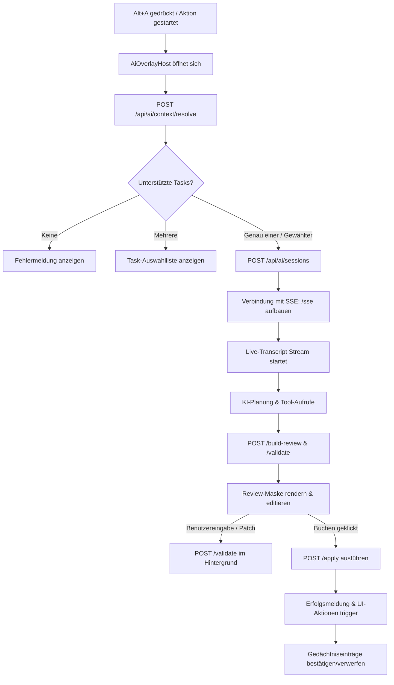

# Übersicht: KI-Overlay-Funktion (AI Overlay) in slopware

Das KI-Overlay in **slopware** ist ein zentraler, temporärer Arbeitsbereich (Shell), der KI-gestützte Arbeitsabläufe in der gesamten Webanwendung ermöglicht. Es ist so konzipiert, dass es sich nahtlos in das System integriert, ohne permanenten Platz auf dem Bildschirm zu beanspruchen.

---

## 1. Architektur-Prinzipien & Invarianten

Die Implementierung folgt strengen Richtlinien, um Ausfallsicherheit, Datenschutz und Benutzerkontrolle zu gewährleisten:

- **Zero-Footprint (Kein permanenter Platzbedarf):** Das Overlay wird als temporäres Sheet (`AiOverlayHost`) über dem aktuellen Modul eingeblendet. Es gibt keine persistenten KI-Seitenleisten, geteilten Layouts oder permanenten KI-Spalten.
- **Keine direkten Schreibzugriffe durch die KI:** Die KI (das LLM) liest Kontextinformationen und schlägt strukturierte Datenänderungen vor, führt jedoch **niemals** eigenständige Schreibvorgänge oder Mutationen direkt in der Datenbank aus. Alle Änderungen werden als Entwurf (Review) vorgelegt, den der Benutzer manuell bestätigen muss.
- **Transaktionales Buchen (Apply):** Erst wenn der Benutzer auf "Aktionen buchen" klickt, werden die Änderungen über vordefinierte, kontrollierte Server-Aktionen validiert und in einer Transaktion festgeschrieben.
- **Mandantensicherheit (Tenant Isolation):** Der Mandantenkontext (`tenantId`) wird ausschließlich serverseitig aus der aktuellen Benutzersitzung aufgelöst. Die KI kann niemals Client-seitige IDs überschreiben oder manipulieren.
- **Zentrale Tastatursteuerung:** Die Steuerung des Overlays (Öffnen, Schließen) erfolgt ausschließlich über den zentralen `CommandProvider`. Es gibt kein ad-hoc Keyboard-Event-Handling in einzelnen Ansichten.

---

## 2. Der End-to-End Workflow / Lebenszyklus

Der Prozess läuft in klar definierten Schritten ab, wenn ein Benutzer die KI-Unterstützung anfordert:

### Schritt 2.1: Kontextauflösung (Context Resolution)

Wenn der Benutzer das Overlay über das globale Tastenkürzel `Alt+A` oder eine Schaltfläche öffnet, ermittelt das System den aktuellen Fokusbereich (aktives Workspace-Modul, Panel, fokussierte Zeile/ID) und sendet diesen an den Server:

- **Endpoint:** `POST /api/ai/context/resolve`
- **Logik:** Wenn der Benutzer sich z. B. im E-Mail-Modul befindet und ein E-Mail-Thread fokussiert ist, prüft der Server, ob dieser Thread existiert und zum Mandanten gehört. Er gibt dann die für diesen Kontext registrierten Tasks zurück (z. B. `mail-order-review` zur Auftragsprüfung).

### Schritt 2.2: Sitzungserstellung & SSE-Stream (Session & SSE Pipeline)

Wenn ein Task ausgewählt oder automatisch gestartet wird, erzeugt die Anwendung eine dedizierte KI-Sitzung und öffnet einen Server-Sent Events (SSE) Stream:

- **Endpoints:**
  1.  `POST /api/ai/sessions` (Erstellt Sitzungs-ID)
  2.  `GET /api/ai/sessions/:sessionId/sse` (Echtzeit-Datenstrom)
- **Phasen des Streams:**
  1.  `resolving-context`: Der Server lädt und projiziert die relevanten Kontextdaten.
  2.  `interpreting`: Der KI-Agent analysiert den Inhalt der E-Mail oder des Belegs.
  3.  `chunk`: Während des Durchlaufs sendet der Agent Gedanken (`reasoning`) und aufgerufene Werkzeuge (`tool_call`) an den Client. Diese werden im **Live-Transkript** des Overlays in Echtzeit visualisiert.
  4.  `awaiting-user-input`: Tritt ein, falls die Zuordnung von Partnern (z. B. Kundennummer) mehrdeutig ist und der Benutzer eingreifen muss.
  5.  `building-review`: Der Beleg- oder Klassifikationsentwurf wird strukturiert aufgebaut.
  6.  `completed`: Der Stream wird geschlossen und der Review-Zustand geladen.

### Schritt 2.3: Entwurfsprüfung & Validierung (Review & Validation)

Nach Abschluss des Streams wird die für den Task zuständige Review-Komponente gerendert.

- Der Benutzer sieht die extrahierten Vorschläge (z. B. Belegkopf, Positionen, verlinkte Adressen).
- Der Benutzer kann Felder direkt anpassen oder korrigieren.
- Jede Änderung triggert eine optimistische Hintergrund-Validierung (`POST /api/ai/reviews/:reviewId/validate`), um sofortige Rückmeldung über Fehler oder Warnungen zu geben.

### Schritt 2.4: Buchen (Apply Phase)

Klickt der Benutzer auf **"Aktionen buchen"**, wird die Transaktion auf dem Server gestartet:

- **Endpoint:** `POST /api/ai/reviews/:reviewId/apply`
- **Auswirkungen:**
  - Der eigentliche ERP-Beleg (z. B. ein Verkaufsauftrag) wird in der Datenbank erzeugt.
  - Verlinkungen (z. B. Zuweisen der E-Mail zum neuen Beleg) werden vorgenommen.
  - Die E-Mail wird ggf. als bearbeitet markiert.
  - Die API liefert `nextUiActions` zurück, die das UI anweisen, z. B. den neu erstellten Beleg direkt im Editor zu öffnen oder einen Antwortentwurf im E-Mail-Composer vorzubereiten.

### Schritt 2.5: KI-Gedächtnis (Memory Extraction)

Wurden während der Analyse wichtige Erkenntnisse gewonnen (z. B. "Kunde wünscht zukünftig Lieferung per Express"), schlägt die KI diese nach dem Buchen als "Gedächtniseinträge" vor. Der Benutzer kann diese einzeln per Klick bestätigen (`confirm`) oder verwerfen (`reject`).

---

## 3. Registrierte Task-Scopes

Aktuell sind folgende standardisierte Tasks im System registriert:

| Task-Scope               | Label (DE)                       | Symbol (Icon) | Beschreibung                                                                                   |
| :----------------------- | :------------------------------- | :------------ | :--------------------------------------------------------------------------------------------- |
| `mail-classification`    | E-Mail klassifizieren & zuordnen | Tag           | Ordnet E-Mails Projekten, Kunden oder Geschäftspartnern zu.                                    |
| `mail-to-document-draft` | Belegentwurf vorschlagen         | FileText      | Generiert Entwürfe für ERP-Belege direkt aus E-Mail-Texten.                                    |
| `mail-order-review`      | Mail-Bestellung prüfen           | Sparkles      | Spezifischer Flow zur Überprüfung und Erstellung von Bestellungen aus E-Mails.                 |
| `mail-compose-draft`     | Mail verfassen                   | MailPlus      | Ermöglicht das KI-gestützte Verfassen von E-Mails (direkter Client-Aufruf, ohne SSE-Pipeline). |

---

## 4. Wichtige Quellcode-Dateien

### Frontend-Komponenten & Hooks

- [AiOverlayHost.tsx](file:///home/ubuntu/slopware/apps/web/src/components/ai/AiOverlayHost.tsx): Die Hauptkomponente des Overlays, die den Lebenszyklus steuert, das Live-Transkript rendert und die Review-Steuerelemente anzeigt.
- [ai-capability-registry.tsx](file:///home/ubuntu/slopware/apps/web/src/lib/ai/ai-capability-registry.tsx): Der Client-Registrierungsdienst, an den Review-Renderer (z. B. `MailOrderReview`) gebunden werden.
- [useAiContextResolution.ts](file:///home/ubuntu/slopware/apps/web/src/components/ai/hooks/useAiContextResolution.ts): Hook zur automatischen Kontextauflösung beim Öffnen des Overlays.
- [useAiTaskStream.ts](file:///home/ubuntu/slopware/apps/web/src/components/ai/hooks/useAiTaskStream.ts): Hook zur Verwaltung der SSE-Verbindung und Verarbeitung der Stream-Events.
- [useAiActionApply.ts](file:///home/ubuntu/slopware/apps/web/src/components/ai/hooks/useAiActionApply.ts): Hook zur Abwicklung der Validierungs- und Buchungsschritte.

### Backend-Routing & Orchestrierung

- [$.ts (API-Endpunkte)](file:///home/ubuntu/slopware/apps/web/src/routes/api/ai/$.ts): Fängt alle API-Anfragen (`/api/ai/*`) ab und delegiert sie an die Services weiter.
- [ai-orchestrator.ts (Service)](file:///home/ubuntu/slopware/packages/db/src/services/ai-orchestrator.ts): Der zentrale Backend-Service, der den KI-Agenten instanziiert, die Tools ausführt, die Interpretation abspeichert und das endgültige Review-Payload generiert.
